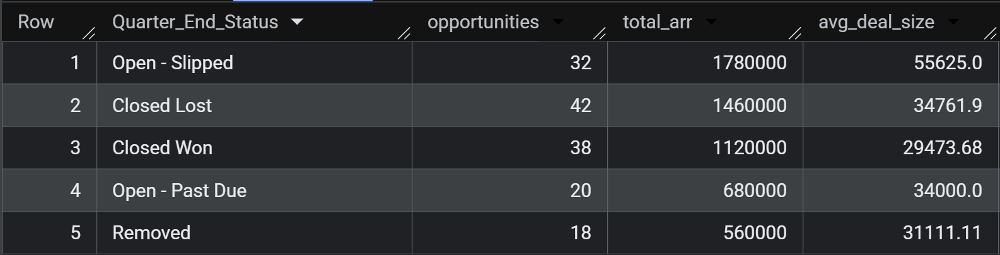
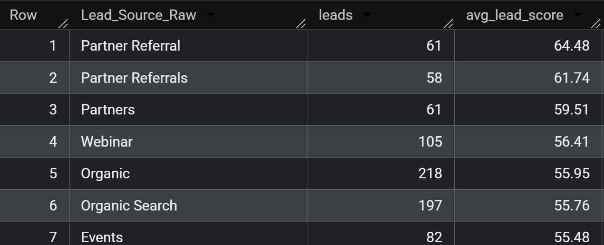
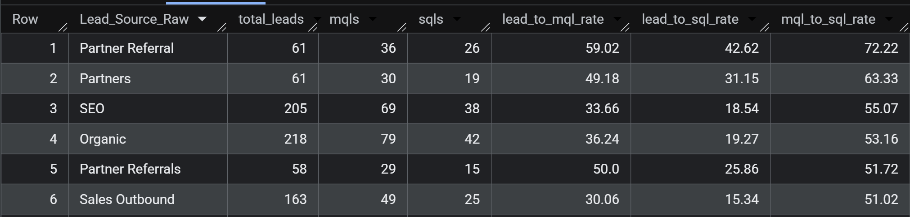
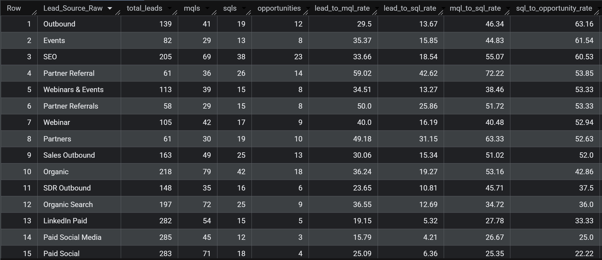
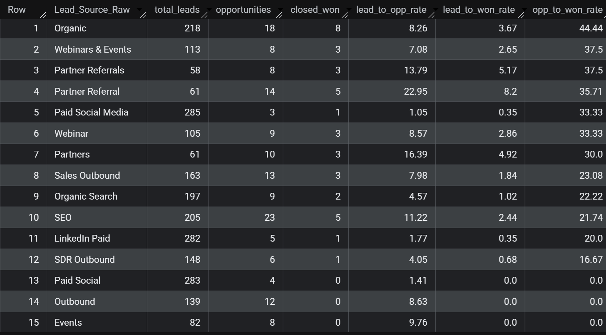
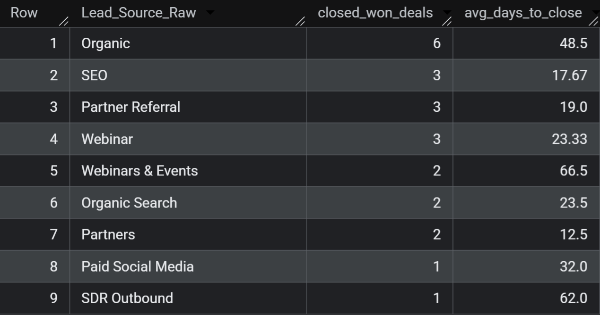
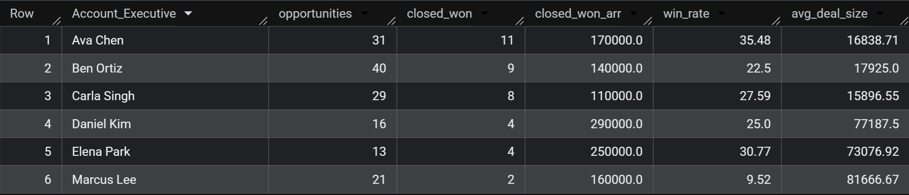
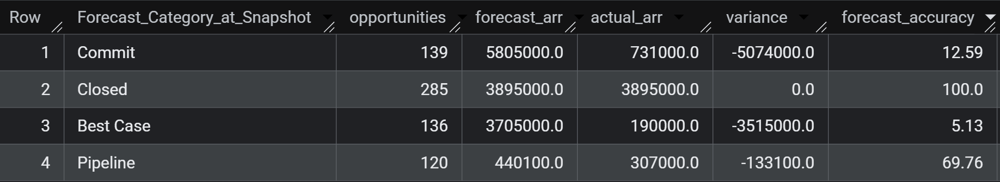
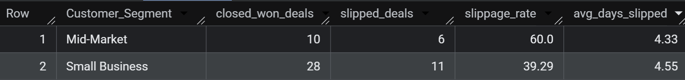
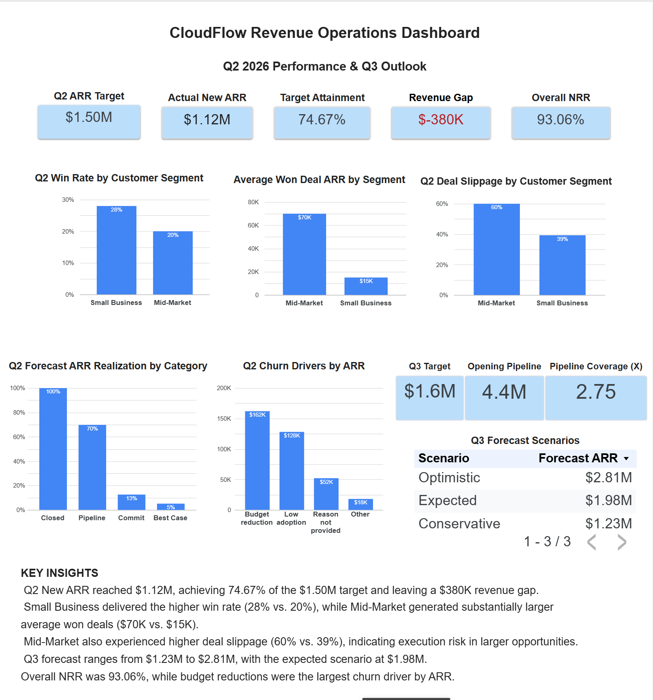

# CloudFlow Revenue Operations Analytics Project

A Revenue Operations analytics project built with Google BigQuery, SQL, and Looker Studio.

This project analyzes Q2 2026 revenue performance for CloudFlow, a fictional B2B SaaS company, and builds a data-driven outlook for Q3.

The goal of the project is not only to calculate business metrics, but to understand why the company missed its revenue target and identify the areas that should receive the most attention going into Q3.

The analysis follows the revenue journey from leads and sales opportunities through closed revenue, forecasting, deal slippage, customer retention, and Q3 pipeline.

---

## Business Problem

CloudFlow had a Q2 2026 New ARR target of **$1.50M**, but finished the quarter with only **$1.12M in Actual New ARR**.

This resulted in:

- **Target:** $1.50M
- **Actual New ARR:** $1.12M
- **Revenue Gap:** $380K
- **Target Attainment:** 74.67%

The main business question became:

> Why did CloudFlow miss its Q2 revenue target, and what should the company focus on to improve Q3 performance?

To answer this, I analyzed several areas of the revenue process:

- Lead quality and conversion
- Sales funnel performance
- Customer segment performance
- Sales execution and deal slippage
- Forecast reliability
- Customer retention and churn
- Q3 opening pipeline
- Q3 forecast scenarios

---

## Tech Stack

- **Data Warehouse:** Google BigQuery
- **Language:** SQL
- **Visualization:** Looker Studio
- **Version Control:** Git & GitHub

---

## Analytical Approach

I structured the analysis as a sequence of business questions rather than starting directly with dashboard creation.

The process was:

**Revenue Target → Actual Performance → Revenue Gap → Lead Quality → Funnel Conversion → Segment Performance → Forecast Reliability → Deal Slippage → Retention → Q3 Pipeline → Q3 Forecast**

This allowed me to move from identifying the revenue problem to investigating possible causes and finally evaluating the outlook for the next quarter.

---

# Step 1: Establish the Q2 Revenue Baseline

Before analyzing leads, sales execution, or forecasting, I first needed to understand the basic revenue performance of the company.

The first questions were:

1. What was the Q2 revenue target?
2. How much New ARR was actually closed?
3. What was the revenue gap?
4. What percentage of the target was achieved?

## Why I Started Here

Without establishing the revenue baseline, it would be difficult to evaluate whether problems in the funnel, forecasting, or customer segments were materially
affecting company performance.
The baseline gives me a clear starting point for the rest of the analysis.


I first calculated the company target and Actual New ARR separately.

### SQL

```sql
WITH target AS (

  SELECT
    SUM(New_ARR_Target) AS company_target
  FROM `fifth-flash-489402-h9.cloudflow_revops.targets`
  WHERE Quarter = 'Q2 2026'
    AND Target_Level = 'Company'

),

actual AS (

  SELECT
    SUM(Opportunity_ARR) AS actual_new_arr
  FROM `fifth-flash-489402-h9.cloudflow_revops.opportunities`
  WHERE Analysis_Quarter = 'Q2 2026'
    AND Quarter_End_Status = 'Closed Won'

)

SELECT
  company_target,
  actual_new_arr,
  company_target - actual_new_arr AS revenue_gap,
  ROUND(actual_new_arr / company_target * 100,2) AS attainment_pct
FROM target
CROSS JOIN actual;
```

## Why I Used Two CTEs

The `target` CTE calculates the company-level Q2 target.

The `actual` CTE calculates ARR from opportunities that actually became `Closed Won`.

Both CTEs return one aggregated row, so I used a `CROSS JOIN` to place the target and actual numbers on the same row.

That allowed me to calculate:

- Revenue Gap
- Target Attainment

## Result

| Metric | Result |
|---|---:|
| Q2 Target | $1.50M |
| Actual New ARR | $1.12M |
| Revenue Gap | $380K |
| Target Attainment | 74.67% |

## What I Learned

CloudFlow achieved only **74.67% of its Q2 New ARR target**.

The company missed its goal by **$380K**.

At this point I knew the size of the problem, but I still did not know **why** the target was missed.

The next step was to investigate opportunity and pipeline outcomes.

---

# Step 2: Understand Opportunity Outcomes and Pipeline Health

After identifying the revenue gap, I wanted to understand what happened to the Q2 opportunity pipeline.

I analyzed:

- Quarter-end opportunity status
- Current pipeline stage
- Closed Won vs. Open-Slipped opportunities
- Opportunity ARR
- Average deal size

### Example SQL

```sql
SELECT
  Quarter_End_Status,
  COUNT(*) AS opportunities,
  SUM(Opportunity_ARR) AS total_arr,
  ROUND(AVG(Opportunity_ARR),2) AS avg_deal_size
FROM `fifth-flash-489402-h9.cloudflow_revops.opportunities`
WHERE Analysis_Quarter = 'Q2 2026'
GROUP BY Quarter_End_Status
ORDER BY total_arr DESC;
```

## Why I Analyzed This

A company can have a large pipeline and still miss revenue targets if opportunities:

- remain open,
- slip into future periods,
- are removed,
- or become Closed Lost.

Pipeline size alone does not guarantee revenue.

I needed to understand the **quality and final outcome of the pipeline**, not simply how many opportunities existed.


### Query Result



### What I Found

The Q2 pipeline contained significant ARR that did not convert into revenue:

- **Closed Won:** 38 opportunities generating **$1.12M ARR**
- **Open - Slipped:** 32 opportunities representing **$1.78M ARR**
- **Open - Past Due:** 20 opportunities representing **$680K ARR**
- **Closed Lost:** 42 opportunities representing **$1.46M ARR**
- **Removed:** 18 opportunities representing **$560K ARR**

The largest amount of ARR was in **Open - Slipped opportunities ($1.78M)**, which suggested that deal slippage was an important contributor to the Q2 revenue gap.

This led me to investigate **which customer segments were driving the slippage and whether larger deals were more likely to slip.**
---

# Step 3: Analyze Lead Quality

The next question was whether Marketing generated enough high-quality leads.

I started by looking at:

- Number of leads by source
- Average lead score by source

### SQL

```sql
SELECT
  Lead_Source_Raw,
  COUNT(*) AS leads,
  ROUND(AVG(Lead_Score),2) AS avg_lead_score
FROM `fifth-flash-489402-h9.cloudflow_revops.leads`
WHERE Lead_Cohort_Quarter = 'Q2 2026'
GROUP BY Lead_Source_Raw
ORDER BY avg_lead_score DESC;
```

## Why I Analyzed Lead Quality

A large number of leads is not necessarily valuable.

A source may generate many leads, but those leads may fail to progress through the funnel.

Therefore, I wanted to compare **lead volume with downstream conversion performance**.


### Query Result



### What I Found

Lead quality varied across acquisition sources.

- **Partner Referral** had the highest average lead score at **64.48**
- **Partner Referrals** averaged **61.74**
- **Partners** averaged **59.51**
- **Organic** generated a much larger lead volume (**218 leads**) but had a lower average lead score of **55.95**
- **Organic Search** generated **197 leads** with an average score of **55.76**

This showed that the sources generating the most leads were not necessarily the sources generating the highest-scoring leads.

However, lead score alone does not prove lead quality. I therefore continued the analysis by looking at how leads progressed through the funnel from **Lead → MQL → SQL → Opportunity**.

---

# Step 4: Measure MQL → SQL Conversion

Next, I analyzed how effectively leads progressed through the qualification process.

The funnel at this stage was:

**Lead → MQL → SQL**

### SQL

```sql
SELECT
  Lead_Source_Raw,
  COUNT(*) AS total_leads,
  COUNT(MQL_Date) AS mqls,
  COUNT(SQL_Date) AS sqls,
  ROUND(COUNT(MQL_Date) * 100.0 / COUNT(*),2) AS lead_to_mql_rate,
  ROUND(COUNT(SQL_Date) * 100.0 / COUNT(*),2) AS lead_to_sql_rate,
  ROUND(COUNT(SQL_Date) * 100.0 / COUNT(MQL_Date),2) AS mql_to_sql_rate
FROM `fifth-flash-489402-h9.cloudflow_revops.leads`
WHERE Lead_Cohort_Quarter = 'Q2 2026'
GROUP BY Lead_Source_Raw
ORDER BY mql_to_sql_rate DESC;
```

## How I Think About This Funnel

- **Lead** = potential customer entered the funnel
- **MQL** = Marketing considered the lead qualified
- **SQL** = Sales considered the lead worth pursuing

The conversion rates help identify where qualification is breaking down.

A source may generate many leads but still perform poorly if only a small portion reaches SQL.


### Query Result



### What I Found

Conversion performance varied significantly across lead sources.

- **Partner Referral** showed the strongest qualification performance, with **59.02% Lead → MQL**, **42.62% Lead → SQL**, and **72.22% MQL → SQL** conversion.
- **Partners** also performed well, with a **63.33% MQL → SQL** conversion rate.
- **Organic** generated the highest lead volume among the displayed sources (**218 leads**), but only **19.27%** of those leads reached SQL.
- **SEO** generated **205 leads**, with **18.54%** reaching SQL.
- **Sales Outbound** showed a relatively low **15.34% Lead → SQL** conversion rate.

This reinforced the earlier finding that **lead volume alone does not indicate lead quality**.

Partner-related sources generated fewer leads but generally showed stronger qualification rates, while higher-volume sources such as Organic and SEO converted a smaller percentage of leads into SQLs.

### Business Interpretation

The results suggest that Marketing should evaluate acquisition channels based on both **volume and downstream conversion**, rather than lead count alone.

The next step was to determine whether qualification was the only issue or whether delays in **Sales follow-up** were also affecting funnel performance.

---

# Step 5: Measure SQL → Opportunity Conversion

Getting an SQL is still not the final goal.

The next important question was:

> Which lead sources actually create real Sales opportunities?

### SQL

```sql
SELECT
  Lead_Source_Raw,
  COUNT(*) AS total_leads,
  COUNT(MQL_Date) AS mqls,
  COUNT(SQL_Date) AS sqls,
  COUNT(Linked_Opportunity_ID) AS opportunities,
  ROUND(COUNT(MQL_Date) * 100.0 / COUNT(*),2) AS lead_to_mql_rate,
  ROUND(COUNT(SQL_Date) * 100.0 / COUNT(*),2) AS lead_to_sql_rate,
  ROUND(COUNT(SQL_Date) * 100.0 / COUNT(MQL_Date),2) AS mql_to_sql_rate,
  ROUND(COUNT(Linked_Opportunity_ID) * 100.0 / COUNT(SQL_Date),2)
    AS sql_to_opportunity_rate
FROM `fifth-flash-489402-h9.cloudflow_revops.leads`
WHERE Lead_Cohort_Quarter = 'Q2 2026'
GROUP BY Lead_Source_Raw
ORDER BY sql_to_opportunity_rate DESC;
```

## Why SQL → Opportunity Matters

This metric connects Marketing qualification to actual Sales pipeline creation.

A source can produce many SQLs, but if those SQLs rarely become opportunities, the source may not be producing strong commercial intent.

This helped me move beyond simple lead volume and evaluate **lead quality based on actual pipeline creation**.


### Query Result



### What I Found

The results showed that lead sources performed very differently when converting qualified leads into actual Sales opportunities.

- **Outbound** had the highest SQL → Opportunity conversion rate at **63.16%**.
- **Events** followed closely at **61.54%**.
- **SEO** converted **60.53%** of SQLs into opportunities.
- **Partner Referral** had the strongest earlier-stage qualification performance and still converted **53.85%** of SQLs into opportunities.
- **Organic** generated a high volume of leads and SQLs, but its SQL → Opportunity conversion rate was lower at **42.86%**.
- Paid channels performed poorly despite generating the largest lead volumes:
  - **LinkedIn Paid:** 282 leads, but only 5 opportunities and a **33.33%** SQL → Opportunity rate.
  - **Paid Social Media:** 285 leads, but only 3 opportunities and a **25.00%** SQL → Opportunity rate.
  - **Paid Social:** 283 leads, but only 4 opportunities and a **22.22%** SQL → Opportunity rate.

### Business Interpretation

This analysis showed why looking only at lead volume can be misleading.

Some of the highest-volume sources, particularly paid channels, generated many leads but relatively few opportunities.

In contrast, sources such as **Outbound, Events, SEO, and Partner Referral** produced stronger downstream conversion into actual Sales pipeline.

This suggests that Marketing performance should be evaluated across the full qualification funnel:

**Lead → MQL → SQL → Opportunity**

rather than using lead volume as the primary measure of success.

The next step was to analyze whether **Sales follow-up speed and activity** could also be contributing to conversion performance.

---

# Step 6: Analyze the Full Lead → Opportunity → Closed Won Funnel

I then connected the `leads` and `opportunities` tables.

The goal was to analyze the full funnel:

**Lead → Opportunity → Closed Won**

### SQL

```sql
SELECT
  l.Lead_Source_Raw,
  COUNT(*) AS total_leads,
  COUNT(l.Linked_Opportunity_ID) AS opportunities,

  COUNT(CASE WHEN o.Quarter_End_Status = 'Closed Won' THEN 1 END
  ) AS closed_won,
  ROUND(COUNT(l.Linked_Opportunity_ID) * 100.0 / COUNT(*), 2) AS lead_to_opp_rate,
  ROUND(COUNT(CASE WHEN o.Quarter_End_Status = 'Closed Won' THEN 1 END) * 100.0
  / COUNT(*), 2) AS lead_to_won_rate,
  ROUND(COUNT(CASE WHEN o.Quarter_End_Status = 'Closed Won' THEN 1 END) * 100.0
  / COUNT(l.Linked_Opportunity_ID),2) AS opp_to_won_rate

FROM `fifth-flash-489402-h9.cloudflow_revops.leads` AS l

LEFT JOIN `fifth-flash-489402-h9.cloudflow_revops.opportunities` AS o
  ON l.Linked_Opportunity_ID = o.Opportunity_ID

WHERE l.Lead_Cohort_Quarter = 'Q2 2026'

GROUP BY l.Lead_Source_Raw

ORDER BY opp_to_won_rate DESC;
```

## Why I Used a LEFT JOIN

The `leads` table is the starting point of this analysis.

Not every lead has an opportunity.

Using a `LEFT JOIN` allows me to keep all leads in the analysis, including leads that never progressed to an opportunity.

If I used an `INNER JOIN`, those non-converting leads would disappear and the funnel conversion rates could look artificially better.


### Query Result



### What I Found

The full-funnel analysis showed that lead sources differed significantly not only in pipeline creation, but also in their ability to generate Closed Won opportunities.

- **Partner Referral** showed strong overall funnel performance: **22.95%** of leads became opportunities and **8.20%** became Closed Won.
- **Partner Referrals** converted **13.79%** of leads into opportunities and **5.17%** into Closed Won.
- **Organic** generated the most Closed Won opportunities among the displayed sources (**8**) and had the highest Opportunity → Won rate at **44.44%**.
- **SEO** generated **23 opportunities**, the highest opportunity count, but only **5** became Closed Won, resulting in a **21.74%** Opportunity → Won rate.
- Paid channels generated high lead volume but very little final revenue conversion. For example, **Paid Social Media** generated **285 leads**, but only **1 Closed Won** opportunity.
- Some sources such as **Outbound** and **Events** generated opportunities but had **no Closed Won opportunities** in this Q2 cohort.

### Business Interpretation

This analysis confirmed that lead volume alone is not a reliable measure of channel performance.

Some sources generated hundreds of leads but produced very few Closed Won opportunities, while Partner Referral generated much lower volume but showed substantially stronger end-to-end conversion.

By connecting the Leads and Opportunities tables, I was able to evaluate acquisition sources based on their contribution to the full Sales funnel:

**Lead → Opportunity → Closed Won**

This provides a more meaningful view of lead quality because the analysis follows leads beyond Marketing qualification and into actual Sales outcomes.

---

# Step 7: Measure Sales Cycle by Lead Source

Conversion rate tells me **whether** leads close.

Sales cycle tells me **how long** they take to close.

### SQL

```sql
SELECT
  l.Lead_Source_Raw,
  COUNT(*) AS closed_won_deals,
  ROUND(AVG(DATE_DIFF( o.Actual_Close_Date,l.Lead_Created_Date, DAY)),2)
  AS avg_days_to_close

FROM `fifth-flash-489402-h9.cloudflow_revops.leads` l

JOIN `fifth-flash-489402-h9.cloudflow_revops.opportunities` o
  ON l.Linked_Opportunity_ID = o.Opportunity_ID

WHERE l.Lead_Cohort_Quarter = 'Q2 2026'
  AND o.Quarter_End_Status = 'Closed Won'
  AND o.Actual_Close_Date >= l.Lead_Created_Date

GROUP BY l.Lead_Source_Raw

ORDER BY closed_won_deals DESC;
```

## Why Sales Cycle Matters

Two lead sources can have similar win rates but very different time-to-close.

A source that closes faster can contribute revenue sooner and make quarterly forecasting more predictable.


### Query Result



### What I Found

Sales cycle length varied significantly across lead sources.

- **Organic** generated the highest number of Closed Won deals (**6**), but had an average sales cycle of **48.5 days**.
- **SEO** generated **3 Closed Won deals** with a much faster average sales cycle of **17.67 days**.
- **Partner Referral** also generated **3 wins** and closed in approximately **19 days** on average.
- **Partners** had the fastest average sales cycle at **12.5 days**, although the result was based on only **2 Closed Won deals**.
- **Webinars & Events** and **SDR Outbound** had much longer sales cycles at **66.5** and **62 days** respectively.

### Business Interpretation

The results show that lead sources should not be evaluated only by conversion rate or number of wins.

For example, **Organic** generated the most Closed Won deals, but those deals took considerably longer to close than SEO or Partner Referral deals.

This matters for Revenue Operations because longer sales cycles can delay revenue recognition and make quarterly forecasting more difficult.

I also need to be careful when comparing sources with only one or two Closed Won deals, because their average sales cycle is based on a small sample.

This analysis adds another dimension to lead-source performance:

**Lead Quality → Conversion → Closed Won → Time to Revenue**

---

# Step 8: Compare Customer Segment Performance

Next, I wanted to understand whether performance differed between:

- Small Business
- Mid-Market

### SQL

```sql
SELECT
  Customer_Segment,
  COUNT(*) AS opportunities,

  COUNT(CASE WHEN Quarter_End_Status = 'Closed Won' THEN 1 END) AS closed_won,
  SUM(CASE WHEN Quarter_End_Status = 'Closed Won'
      THEN Opportunity_ARR ELSE 0 END) AS won_arr,

  ROUND(COUNT(CASE WHEN Quarter_End_Status = 'Closed Won' THEN 1 END) * 100.0
  / COUNT(*),2) AS win_rate,
  ROUND(AVG(Opportunity_ARR),2) AS avg_deal_size

FROM `fifth-flash-489402-h9.cloudflow_revops.opportunities`

WHERE Analysis_Quarter = 'Q2 2026'

GROUP BY Customer_Segment

ORDER BY won_arr DESC;
```

### Query Result


### What I Found

Customer segment performance showed a clear tradeoff between conversion rate and deal value.

- **Small Business** had **100 opportunities** and won **28**, resulting in a **28% win rate**.
- **Mid-Market** had **50 opportunities** and won **10**, resulting in a lower **20% win rate**.
- Despite the lower win rate, Mid-Market generated **$700K in Won ARR**, compared with **$420K from Small Business**.

The query above also shows average opportunity size across all Q2 opportunities:

- **Mid-Market:** $78K
- **Small Business:** $17K

For the dashboard, I separately calculated average deal size using only **Closed Won opportunities**:

- **Mid-Market Average Won Deal ARR:** $70K
- **Small Business Average Won Deal ARR:** $15K

### Business Interpretation

Small Business converted opportunities more efficiently, but Mid-Market produced significantly more revenue per successful deal.

This means the two segments present different opportunities:

- **Small Business** provides stronger conversion efficiency.
- **Mid-Market** provides greater revenue potential per win.

The lower Mid-Market win rate therefore represents an important Revenue Operations opportunity. Improving conversion and execution on these larger deals could have a significant impact on total ARR.

---

# Step 9: Evaluate Account Executive Performance

I also analyzed performance at the individual Account Executive level.

### SQL

```sql
SELECT
  Account_Executive,
  COUNT(*) AS opportunities,

  COUNT(CASE WHEN Quarter_End_Status = 'Closed Won' THEN 1 END) AS closed_won,

  ROUND(SUM(CASE WHEN Quarter_End_Status = 'Closed Won' THEN Opportunity_ARR END),2)
  AS closed_won_arr,

  ROUND(COUNT(CASE WHEN Quarter_End_Status = 'Closed Won' THEN 1 END) * 100.0
  / COUNT(*),2) AS win_rate,

  ROUND(AVG(Opportunity_ARR),2) AS avg_deal_size

FROM `fifth-flash-489402-h9.cloudflow_revops.opportunities`

WHERE Analysis_Quarter = 'Q2 2026'

GROUP BY Account_Executive

ORDER BY closed_won DESC;
```

## Why I Analyzed AE Performance

Company-level performance can hide differences between individual sellers.

AE-level analysis helps identify:

- stronger win rates,
- higher ARR production,
- larger average deals,
- and potential coaching opportunities.


### Query Result



### What I Found

Performance varied significantly across Account Executives.

- **Ava Chen** won the most opportunities (**11**) and had the highest win rate at **35.48%**.
- **Ben Ortiz** managed the largest number of opportunities (**40**) but converted **22.50%** of them into Closed Won.
- **Daniel Kim** won only **4 opportunities**, but generated the highest Closed Won ARR at **$290K**.
- **Elena Park** also won **4 opportunities** and generated **$250K** in Closed Won ARR with a **30.77%** win rate.
- **Marcus Lee** had the lowest win rate at **9.52%**, despite working with the largest average opportunity size.

### Business Interpretation

The analysis showed that AE performance should not be evaluated using a single metric.

For example, Ava Chen led in number of wins and win rate, while Daniel Kim generated the highest Closed Won ARR from fewer deals.

This indicates that seller performance depends on a combination of:

- **Win Rate** — how efficiently opportunities are converted.
- **Closed Won ARR** — how much revenue is generated.
- **Deal Size** — the value of opportunities being managed.
- **Opportunity Volume** — the size of the seller's pipeline.

This type of analysis can help Revenue Operations identify top performers, understand differences in selling patterns, and identify potential coaching opportunities.

---

# Step 10: Evaluate Forecast Reliability

The next question was:

> How closely did Sales forecasts match actual revenue?

### SQL

```sql
SELECT
  Forecast_Category_at_Snapshot,
  COUNT(*) AS opportunities,

  ROUND(SUM(Sales_Forecast_ARR),2) AS forecast_arr,

  ROUND(SUM(Final_Actual_ARR),2) AS actual_arr,

  ROUND(SUM(Final_Actual_ARR) - SUM(Sales_Forecast_ARR),2) AS variance,

  ROUND(
    SUM(Final_Actual_ARR) * 100 /
    SUM(Sales_Forecast_ARR),
    2
  ) AS forecast_accuracy

FROM `fifth-flash-489402-h9.cloudflow_revops.forecast_snapshots`

GROUP BY Forecast_Category_at_Snapshot

ORDER BY forecast_arr DESC;
```

## Key Result

Forecast ARR realization showed:

- **Closed:** 100%
- **Pipeline:** ~70%
- **Commit:** ~13%
- **Best Case:** ~5%

## What I Learned

The low realization of Commit forecast ARR indicated that the forecast categories were not reliably representing actual revenue outcomes.

A deal classified as Commit should normally represent a high-confidence opportunity.

Low realization suggests that forecasting was overly optimistic or Commit criteria were not strict enough.

This became one of the main Revenue Operations findings.


### Query Result



### What I Found

Forecast realization varied significantly across forecast categories.

- **Closed:** $3.90M forecast vs. $3.90M actual — **100% realization**
- **Pipeline:** $440K forecast vs. $307K actual — approximately **70% realization**
- **Commit:** $5.81M forecast vs. only $731K actual — approximately **13% realization**
- **Best Case:** $3.71M forecast vs. only $190K actual — approximately **5% realization**

The largest issue was the **Commit** category.

Commit represented approximately **$5.81M** in forecast ARR, but only about **$731K** was ultimately realized.

### Business Interpretation

A Commit opportunity should represent a relatively high-confidence deal.

However, only about **13% of Commit forecast ARR was realized**, indicating that the forecast was substantially more optimistic than the final revenue outcome.

Best Case also showed very low realization at approximately **5%**.

This suggests that forecast categories were not consistently aligned with actual deal outcomes and that qualification criteria may need to be reviewed.

For Revenue Operations, this creates a forecasting risk because leadership may make planning decisions based on pipeline that is unlikely to convert at the expected level.

This became one of the key findings of the Q2 analysis:

> **Pipeline existed, but forecast confidence did not consistently translate into actual revenue.**

---

# Step 11: Analyze Deal Slippage

Forecasting is not only about whether a deal eventually closes.

Timing also matters.

A deal that closes after its expected date can cause a company to miss a quarterly target even if the deal eventually becomes Closed Won.

I defined a slipped deal as:

**Actual Close Date > Expected Close Date**

### Overall Slippage SQL

```sql
SELECT
  COUNT(*) AS total_closed_deals,

  COUNT(CASE WHEN Actual_Close_Date > Expected_Close_Date THEN 1 END
  ) AS slipped_deals,

  ROUND( COUNT(CASE
        WHEN Actual_Close_Date > Expected_Close_Date
        THEN 1 END) * 100.0 / COUNT(*), 2) AS slippage_rate

FROM `fifth-flash-489402-h9.cloudflow_revops.opportunities`

WHERE Analysis_Quarter = 'Q2 2026'
  AND Quarter_End_Status = 'Closed Won';
```

### Query Result


The query showed:

- **Closed Won Deals:** 38
- **Slipped Deals:** 17
- **Slippage Rate:** 44.74%

This means that nearly half of the deals that became Closed Won closed later than their expected close date.

---

## Deal Slippage by Customer Segment

I then compared slippage between customer segments.

```sql
SELECT
  Customer_Segment,
  COUNT(*) AS closed_won_deals,

  COUNT( CASE WHEN Actual_Close_Date > Expected_Close_Date THEN 1  END
  ) AS slipped_deals,

  ROUND(COUNT(CASE
        WHEN Actual_Close_Date > Expected_Close_Date
        THEN 1 END) * 100.0
  / COUNT(*), 2) AS slippage_rate,

  ROUND(AVG(CASE WHEN Actual_Close_Date > Expected_Close_Date
        THEN DATE_DIFF(Actual_Close_Date, Expected_Close_Date, DAY) END),2
  ) AS avg_days_slipped

FROM `fifth-flash-489402-h9.cloudflow_revops.opportunities`

WHERE Analysis_Quarter = 'Q2 2026'
  AND Quarter_End_Status = 'Closed Won'

GROUP BY Customer_Segment

ORDER BY slippage_rate DESC;
```

## Result

| Segment | Slippage Rate |
|---|---:|
| Mid-Market | 60.00% |
| Small Business | 39.29% |

### Query Result



### What I Found

Deal slippage differed significantly between customer segments.

- **Mid-Market:** 60.00% slippage rate
- **Small Business:** 39.29% slippage rate

Mid-Market opportunities were substantially more likely to close later than expected.

### Business Interpretation

This finding is especially important because Mid-Market deals also generated much larger average won ARR.

The combination of:

- larger deal size,
- lower win rate,
- and higher deal slippage

makes Mid-Market execution a significant revenue risk.

A delayed Mid-Market opportunity can have a much larger impact on quarterly ARR than a delayed Small Business opportunity.

This suggests that Q3 pipeline management should place additional attention on Mid-Market deals, especially expected close dates, next steps, and deal progression.

> **Mid-Market represented higher revenue potential, but also greater execution and timing risk.**

---

# Step 12: Analyze Customer Retention and Churn

New ARR explains only one part of revenue performance.

Revenue Operations also needs to understand what happens to existing customers.

I analyzed:

- Renewal ARR
- Renewal Rate
- Churn Rate
- Expansion ARR
- Contraction ARR
- Ending ARR
- Net Revenue Retention
- Churn reasons

---

## Net Revenue Retention

### SQL

```sql
SELECT
  ROUND(
    SUM(Ending_ARR) * 100.0 /
    SUM(ARR_Due_for_Renewal),2) AS net_revenue_retention

FROM `fifth-flash-489402-h9.cloudflow_revops.customers_renewals_q2`;
```

### Query Result


### Result

**Overall NRR = 93.06%**

### How I explain NRR

Net Revenue Retention measures how much recurring revenue was retained from the existing customer base after accounting for:

- churn,
- contraction,
- and expansion.

An NRR of **93.06%** means CloudFlow retained approximately 93% of the ARR from the Q2 renewal cohort.

Because NRR is below 100%, revenue lost through churn and contraction was greater than the additional ARR generated through expansion.

### Why This Matters

Even if the company generates new ARR, weak retention can offset part of that growth.

This is why I analyzed retention separately from new customer acquisition:

> **New ARR shows how much revenue the company added, while NRR shows how effectively the company protected and expanded its existing recurring revenue.**

---

# Step 13: Identify the Main Churn Reasons

After analyzing overall retention, I wanted to understand **why customers churned**.

Knowing how much ARR was lost is important, but identifying the reasons behind that loss helps determine which problems may be actionable.

### SQL

```sql
SELECT
  Churn_Reason,
  COUNT(*) AS churned_customers,
  SUM(Churned_ARR) AS churned_arr

FROM `fifth-flash-489402-h9.cloudflow_revops.customers_renewals_q2`

WHERE Renewal_Status = 'Churned'

GROUP BY Churn_Reason

ORDER BY churned_arr DESC;
```

### Query Result


## Result

| Churn Reason | Churned Customers | Churned ARR |
|---|---:|---:|
| Budget reduction | 5 | $162K |
| Low adoption | 4 | $128K |
| Reason not provided | 2 | $52K |
| Other | 1 | $18K |

> In the raw data, two churned customers had a `NULL` Churn_Reason.  
> For reporting purposes, I displayed these records as **Reason not provided** in the dashboard.

## What I Learned

The largest churn driver was **Budget Reduction**, accounting for $162K in lost ARR.

The second-largest driver was **Low Adoption**, with $128K in churned ARR.

Budget-related churn may be difficult to prevent completely. Low adoption, however, represents a more actionable customer-success problem.

Customers showing low product adoption could potentially be identified earlier so Customer Success can intervene before renewal.

I also identified a small **data-quality issue**: two churned customers had no churn reason recorded. Capturing churn reasons consistently would make future retention analysis more reliable.

### Business Takeaway

> Retention improvement should focus especially on early identification of low-adoption customers, while churn-reason data should be captured more consistently.

---

# Step 14: Evaluate the Q3 Opening Pipeline

After understanding Q2 performance, I moved to the forward-looking question:

> Does CloudFlow have enough pipeline to reach the Q3 target?

### Overall Pipeline SQL

```sql
SELECT
  COUNT(*) AS opportunities,
  SUM(Opportunity_ARR) AS pipeline_arr

FROM `fifth-flash-489402-h9.cloudflow_revops.q3_opening_pipeline`;
```

## Result

- **Q3 Opening Opportunities:** 77
- **Opening Pipeline ARR:** $4.40M
- **Q3 Target:** $1.60M

---

## Pipeline Coverage

### SQL

```sql
SELECT
  SUM(Opportunity_ARR) AS pipeline_arr,
  1600000 AS q3_target,

  ROUND(
    SUM(Opportunity_ARR) / 1600000,
    2
  ) AS pipeline_coverage

FROM `fifth-flash-489402-h9.cloudflow_revops.q3_opening_pipeline`;
```

## Result

**Pipeline Coverage = 2.75x**

## What Pipeline Coverage Means

CloudFlow entered Q3 with pipeline equal to approximately **2.75 times the revenue target**.

However, this does not mean CloudFlow will automatically hit the target.

Q2 analysis showed:

- Deal slippage
- Low Commit realization
- Different win rates across segments

Therefore, the full $4.40M pipeline should not be treated as expected revenue.

This is why I created forecast scenarios.

---

# Step 15: Build Q3 Forecast Scenarios

Instead of using one forecast number, I created three scenarios:

- Conservative
- Expected
- Optimistic

Each scenario applies different probabilities to:

- Commit
- Best Case
- Pipeline

The purpose is not to say exactly what will happen, but to understand a reasonable range of possible outcomes.

---

## Conservative Scenario

Assumptions:

- Commit = 50%
- Best Case = 20%
- Pipeline = 5%

## Expected Scenario

Assumptions:

- Commit = 70%
- Best Case = 40%
- Pipeline = 10%

## Optimistic Scenario

Assumptions:

- Commit = 90%
- Best Case = 60%
- Pipeline = 25%

### SQL

```sql
SELECT

  ROUND(SUM(CASE
        WHEN Forecast_Category = 'Commit' THEN Opportunity_ARR * 0.50
        WHEN Forecast_Category = 'Best Case' THEN Opportunity_ARR * 0.20
        WHEN Forecast_Category = 'Pipeline' THEN Opportunity_ARR * 0.05
         ELSE 0 END),2) AS conservative_forecast,

  ROUND(SUM(CASE
        WHEN Forecast_Category = 'Commit' THEN Opportunity_ARR * 0.70
        WHEN Forecast_Category = 'Best Case' THEN Opportunity_ARR * 0.40
        WHEN Forecast_Category = 'Pipeline' THEN Opportunity_ARR * 0.10
        ELSE 0 END),2) AS expected_forecast,

  ROUND(SUM(CASE
        WHEN Forecast_Category = 'Commit' THEN Opportunity_ARR * 0.90
        WHEN Forecast_Category = 'Best Case' THEN Opportunity_ARR * 0.60
        WHEN Forecast_Category = 'Pipeline' THEN Opportunity_ARR * 0.25
        ELSE 0 END),2) AS optimistic_forecast

FROM `fifth-flash-489402-h9.cloudflow_revops.q3_opening_pipeline`;
```

## Result

| Scenario | Q3 Forecast ARR |
|---|---:|
| Conservative | $1.233M |
| Expected | $1.978M |
| Optimistic | $2.813M |

## What I Learned

The Expected and Optimistic scenarios exceed the **$1.60M Q3 target**.

However, the Conservative scenario falls below target.

This means CloudFlow has enough pipeline on paper, but execution quality matters.

Q3 performance will depend heavily on:

- preventing deal slippage,
- focusing on high-value late-stage opportunities,
- improving forecast discipline,
- and converting pipeline into actual Closed Won ARR.

---


# Final Looker Studio Dashboard

After completing the SQL analysis, I built a Looker Studio dashboard to present the most important findings in a format that leadership could review quickly.

The dashboard includes:

- Q2 ARR Target
- Actual New ARR
- Target Attainment
- Revenue Gap
- Overall NRR
- Win Rate by Customer Segment
- Average Won Deal ARR by Segment
- Deal Slippage by Segment
- Forecast ARR Realization
- Churned ARR by Reason
- Q3 Forecast Scenarios


## 🔗 Live Dashboard

🚀 **[Open Looker Studio Dashboard](https://datastudio.google.com/reporting/8404c542-2a3b-4ff0-856b-8c911c7489b0)** 

---



---

# Key Findings

## Q2 Revenue Performance

CloudFlow generated **$1.12M in New ARR against a $1.50M target**.

Target attainment was **74.67%**, leaving a **$380K revenue gap**.

## Segment Performance

Small Business had the stronger win rate:

- Small Business: **28%**
- Mid-Market: **20%**

However, Mid-Market generated significantly larger average won deals:

- Small Business: **$15K**
- Mid-Market: **$70K**

## Deal Slippage

Overall Closed Won deal slippage was approximately **44.74%**.

Mid-Market had the highest slippage rate:

- Mid-Market: **60%**
- Small Business: **39.29%**

This created additional risk because Mid-Market deals were substantially larger.

## Forecast Reliability

Forecast ARR realization was low for several forecast categories.

Commit ARR realization was only about **13%**, indicating that the forecast was overly optimistic relative to actual outcomes.

## Retention

Overall Net Revenue Retention was **93.06%**.

This means existing customer revenue declined after accounting for churn, contraction, and expansion.

## Churn

The largest churn drivers were:

- Budget Reduction: **$162K**
- Low Adoption: **$128K**

## Q3 Outlook

CloudFlow entered Q3 with:

- **$4.40M opening pipeline**
- **$1.60M Q3 target**
- **2.75x pipeline coverage**

Forecast scenarios ranged from:

**$1.23M Conservative → $1.98M Expected → $2.81M Optimistic**

---

# Recommendations

## 1. Improve Lead Funnel Performance

### Action

Focus more attention on lead sources that successfully convert from SQL into real Sales opportunities.

### What to Do

Do not evaluate sources only by the number of leads they generate.

Compare lead volume with:

- SQL conversion
- Opportunity creation
- Closed Won performance

Reduce focus on sources that generate many leads but few real opportunities.

---

## 2. Improve Forecast Discipline

### Action

Tighten the criteria used to classify opportunities as Commit and review forecast categories regularly.

### What to Do

Do not move a deal into **Commit** unless there is strong evidence that it will close.

Review:

- Pipeline
- Best Case
- Commit

on a regular basis and challenge opportunities that do not have clear next steps or realistic close dates.

---

## 3. Reduce Deal Slippage

### Action

Identify opportunities at risk of missing expected close dates before they slip.

### What to Do

Pay particular attention to Mid-Market opportunities because:

- they have higher ARR,
- and they experienced the highest Q2 slippage rate.

Sales should proactively review high-value opportunities approaching their expected close date.

---

## 4. Improve Small Business Retention

### Action

Prioritize customers showing low adoption or other signs of renewal risk.

### What to Do

Identify customers who are not using the product enough before renewal.

Customer Success should contact these customers early and attempt to improve adoption before the renewal conversation begins.

---

## 5. Prioritize the Q3 Pipeline

### Action

Focus Sales attention on high-value, late-stage opportunities that have the greatest probability of contributing to the $1.60M Q3 target.

### What to Do

Do not treat all **77 Q3 opportunities** equally.

Prioritize opportunities based on:

- Deal size
- Current stage
- Forecast category
- Close-date confidence
- Recent activity

The objective is to protect the deals most likely to convert into Q3 revenue.

---

# What I Learned From This Project

This project helped me understand that Revenue Operations analysis is not about one metric.

Missing a revenue target can be caused by multiple connected factors:

- weak lead quality,
- funnel conversion,
- Sales execution,
- deal timing,
- forecasting,
- customer churn,
- and pipeline quality.

I also learned that a large pipeline does not automatically mean a company will hit its target.

Pipeline needs to be evaluated together with:

- win rates,
- forecast reliability,
- deal slippage,
- segment performance,
- and historical execution.

From a SQL perspective, this project gave me practical experience with:

- CTEs
- `CASE WHEN`
- conditional aggregation
- `COUNT`
- `SUM`
- `AVG`
- conversion-rate calculations
- `DATE_DIFF`
- joins
- `CROSS JOIN`
- funnel analysis
- pipeline analysis
- retention metrics
- forecast scenario modeling

Most importantly, I practiced moving beyond SQL output and translating the results into:

**Business Question → Analysis → Insight → Recommendation**

---

# Project Files

- [`sql/CloudFlow_RevOps_Full_Analysis.sql`](sql/CloudFlow_RevOps_Full_Analysis.sql) — complete SQL analysis
- `CloudFlow_Executive_Summary.pdf` — executive summary with key findings and recommendations
- `images/CloudFlow_RevOps_Dashboard.png` — Looker Studio dashboard

---

# Skills Demonstrated

**SQL • BigQuery • Revenue Operations • Funnel Analysis • Sales Analytics • Pipeline Analysis • Forecasting • Deal Slippage Analysis • Retention Analysis • Churn Analysis • Looker Studio • Business Recommendations**

